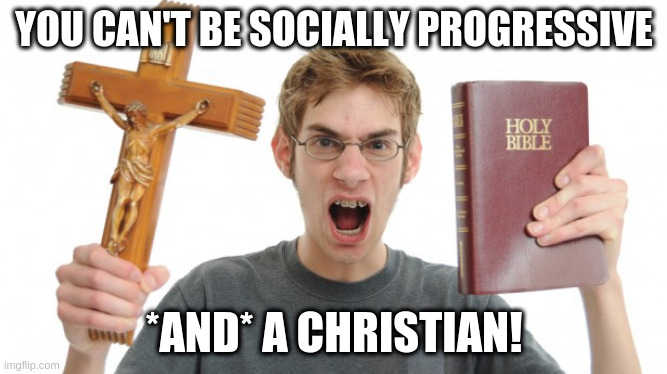

# 

The reaction I get from most non-Christians & socially conservative Christians
when they find out I'm both socially progressive & Christian is mostly the same:

(with maybe a little less crucifix-wielding from the non-Christians).
They either think you're not really Christian or not really progressive.
Why is that?
Both atheists and conservative Christians have pushed a particular theology
as being objectively or uniquely Christian [@McClellanLiteralism],
while progressive Christians have been less clear
in putting their theology out there (at least in my opinion).
So, I'm gonna try to work on that!

# My Path to Progressive Christianity

I grew up as a hardcore conservative evangelical.
Eventually though, I started noticing too many disconnects between that
and what I was reading in the Bible, or how I felt after praying.
I became more and more socially progressive,
though I didn't have a *complete* rooting of this
in Scripture or in any particular theology.
Some conflicts started piling up,
like my support for LGBT folks and the "clobber passages"
conservatives use to say homosexuality is a sin.
My approach (for too long) was to just pray and follow my God-given conscience
(see Romans 14:1-23; 1 John 3:21)
but not necessarily to try to resolve these conflicts in terms of theology.
Is there a *coherent*, **faithful** Christian theology
that supports socially progressive views?
Or are progressive Christians just deceiving themselves (1 Timothy 4:1-2)
or picking and choosing which parts of Christianity to believe
based on their own desires (2 Timothy 4:3)?

After a lot of study, prayer, and thought,
I've come to a theological approach that's not only coherent,
but faithfully seeks truth rather than simply seeking self-justification.
This has strengthened my faith, brought me peace,
and often deepened my commitment to progressive values that my conscience
had intuitively been steering me toward.

# Progressive Christian Theology: The Good, the Bad, and the Ugly

So how does this work?
Well if I could answer it all in one simple post I wouldn't need a blog!
But, in this first post I want to give some broad strokes that apply generally,
explain what most progressive theologians are after,
and where I disagree or diverge with them.

The starting point is realizing that some popularizations of Christianity,
often claiming to be "biblical Christianity" or something similar,
are not truly just some objective interpretation of the biblical text,
or some "pure" form of Christianity.
**All** theology and biblical interpretation occurs through a lens.
Interpretations and theological stances I'd been told were basically just
plainly said in the Bible really weren't if you think it through deeply.
Progressive Christian theology^[I want to be careful here because progressive Christian theology need not *necessarily* be theology supportive of socially progressive stances, though that is often the case. I'm conflating them a little in this blog post, though I might do a deeper dive on this nuance some other week.]
always starts with this "deconstruction" process,
where you take apart what you've been *taught to believe* about your religion
to see what's really supported and what you *do believe* about your religion.

I have three main beefs with some other progressive Christian theology though:
they often hide the ball, they don't always seem to be seeking truth,
and they often seem to deny spiritual aspects of Christianity.
I think there are some good critiques of progressive Christianity
along these lines from conservative Christians
[e.g. @BertuzziChilders; @WingerProgSadducees],
though I disagree with these critiques' ultimate conclusions.

Alissa Childers often recounts her foray into progressive Christianity
in which her pastor eventually disclosed to her in a private group
that he was actually agnostic [@BertuzziChilders]!
I have had a similar experience, which is what I mean about hiding the ball,
and (in my view both wrongly and unnecessarily) discounting or denying
spiritual aspects of Christianity.

Moreover, this deconstruction process for many progressive Christians
*starts* with good intentions, but isn't *completed* in good faith,
which is a pretty scathing but in my experience accurate critique
from Alissa Childers [@BertuzziChilders].^[I know I keep bringing up Alissa Childers, but as much as I disagree with her, progressive Christians would do well to address her not-baseless critiques!]
It starts because we intuitively feel that something is morally wrong
in where much of the Church has ended up, and so we (rightly) ask questions.
However, it often seems like folks aren't seeking truth in that process.
They either stop shy of seeking answers (like the agnostic pastor above),
or they settle on answers that please them too quickly,
uncritically accepting some claims that in my view aren't rock solid.

In short, progressive Christianity, I think, is great,
but it can have some flaws in execution like anything else.
It starts from a place of recognizing moral rot in the Church
and seeking truth about the divine,
though I disagree with some progressive Christian theologians' conclusions,
and especially them sometimes not being upfront about their conclusions.

# *My* Progressive Christian Theology

The approach that I've settled on, which seems coherent to me,
which seems *right* to me, and allows me to faithfully seek truth, is this:

  - Study the Bible religiously (ba-dum-tiss).
    I do not believe the Bible is the only source of religious truth,
    but it sure is an important one and I'm leery of folks
    who seem to de-emphasize Scripture.
  - But, study history to understand the *context* of what these folks wrote!
    You can't understand a text without understanding its context.
  - Relatedly, as much as you're able, study (in/about) the original language.
    Translation, as any good translator will tell you, is an interpretive act.
    There was not an English translation of the Bible until after
    over one thousand years of doctrinal development in Christianity!
    That said, I think most translations are mostly pretty good.
    But I often find my perspective changes, at least a little,
    after looking into a little Greek or Hebrew.
  - And here's the kicker: Judge all your conclusions against the lodestars
    of (1) the fruits of the conclusions (Matthew 7:15-20),
    and (2) the greatest commandments as stated by Christ:
    Love God, and love people (Matthew 22:36-39).

In short: Study, pray, and think (a lot!), but then always, *always*,
check your theoglogical conclusions against two things:
If it is of God, it should be life-giving, and it should be loving.
It it's not those things, you've developed bad theology.
That's what progressive Christian theology is all about for me.
That's what it means to be a Christian for me,
and that's ultimately why I'm socially progressive.

# References
